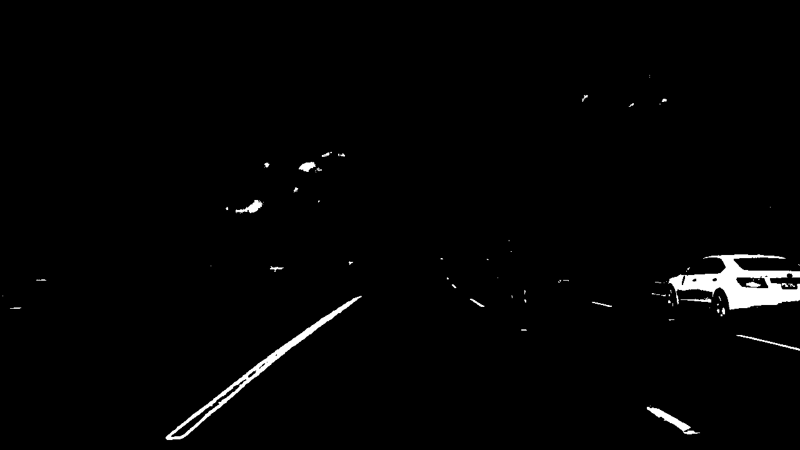

# Advance Lane Lines Finder - Writeup

## Goals

The goals/steps of this project are the following:

- Compute the camera calibration matrix and distortion coefficients given a set of chessboard images.
- Apply a distortion correction to raw images.
- Use color transforms, gradients, etc., to create a thresholded binary image.
- Apply a perspective transform to rectify binary image ("birds-eye view").
- Detect lane pixels and fit to find the lane boundary.
- Determine the curvature of the lane and vehicle position on center.
- Warp the detected lane boundaries back onto the original image.
- Output visual display of the lane boundaries and numerical estimation of lane curvature and vehicle position.

## [Rubric](https://review.udacity.com/#!/rubrics/571/view) points

### Writeup / README

#### 1. Provide a Writeup / README that includes all the rubric points and how you addressed each one. You can submit your writeup as markdown or pdf. [Here](https://github.com/udacity/CarND-Advanced-Lane-Lines/blob/master/writeup_template.md) is a template writeup for this project you can use as a guide and a starting point.

### Camera calibration

#### 1. Briefly, state how you computed the camera matrix and distortion coefficients. Provide an example of a distortion corrected calibration image.

Using `cv2.findChessboardCorners`, the corners points are stored in an array `imgpoints` for each calibration image where the chessboard could be found. The object points will always be the same as the known coordinates of the chessboard with zero as 'z' coordinate because the chessboard is flat. The object points are stored in an array called `objpoints`. I then used the output objpoints and imgpoints to compute the camera calibration and distortion coefficients using the `cv2.calibrateCamera` function. I applied this distortion correction to the test image using the `cv2.undistort` function and obtained this result:
For code snippets, please refer to `In [6]` on [Advance Lane Lines notebook](AdvanceLaneLines.ipynb). 


The camera calibration and distortion coefficients are stored in global variables at line `In [6]` that are used through out the pipeline [Advance Lane Lines notebook](AdvanceLaneLines.ipynb)

### Pipeline (single images)

The code used to implement these functionality could be found at [Advanced Lane Lines notebook](AdvanceLaneLines.ipynb).

#### 1. Provide an example of a distortion-corrected image.
The camera calibration calculation is the Step 1 in  [Advanced Lane Lines notebook](AdvanceLaneLines.ipynb)
please find the code snippet in code cell `In [2]`
The following image shows the result of applying the camera calibration to one of the test images:


More output images of this step can be found in the folder ./output_images/step1/

#### 2. Describe how (and identify where in your code) you used color transforms, gradients or other methods to create a thresholded binary image. Provide an example of a binary image result.

Please refer to `In [5]` & `In [6]` code cells which implements the Edge Detection pipeline.

Below steps describle how the edge detection pipeline works, which is implemented in 'edgeDetectSobel' 
function in code cell `In [5]`

-> First step in edge detection pipeline is to undistort the image 
using the Camera Calibration matrix and distortion coefficients obtained from Step 1 `In [3]`

-> Next is color transform, conversion from RGB to HLS and extract only SChannel to work with, S channel was selected because it shows more contrast on the lane lines

-> Schannel output from above step is used to calculate the Sobel gradient on the x and y directions using `sobel_kernel` as Sobel kernel size of 3.

-> Next detect both edges - output image from the Sobel function has signed values
(positive and negative slopes) representing black to white transitions 
and white to black transitions. Therefore the absolute values are taken and then scaled back to unsigned 8 bit image from CV_64F datatype

-> Output from above step which has x and y gradients is passed to a thresholding function to get a binary image

-> To generate a single gradients image, both x and y images from previous step is combined and returned as output image.

Please note that this method worked for most of the times but failed in some instances therefore as per 
the reviewer suggestions I used very simple lane line detection method based on combination of yellow and white colors.
-> The B channel from LAB with thresholds between 150 and 200 for extracting Yellow lines
-> The L channel from LUV with thresholds between 255 and 255 for extracting white lines

An example of Thresholded binary output image is shown below 

More output images of this step can be found in the folder ./output_images/step3/

#### 3. Describe how (and identify where in your code) you performed a perspective transform and provided an example of a transformed image.

Please refer to code cell `In [7]` for the implementation of perspective transform. The image used were the one with straight lane lines:


Four points where selected on the first image as the source of the perspective transformation. Those points are highlighted on the following image (`In [4]`):


The destination points for the transformation where to get a clear picture of the street:

|Source|Destination|
|-----:|----------:|
|(585, 455)|(200,0)|
|(705, 455)|(maxX - 200, 0)|
|(1130, 720)|(maxX - 200, maxY)|
|(190, 720)|(200, maxY)|

Using `cv2.getPerspectiveTransform`, a transformation matrix was calculated, and an inverse transformation matrix was also calculated to map the points back to the original space (`In [7]`). The result of the transformation on a test image is the following:


The following picture shows the binary images results after the perspective transformation:


Output images of this step are located in the folder ./output_images/step4/

#### 4. Describe how (and identify where in your code) you identified lane-line pixels and fit their positions with a polynomial?

The line detection code could be found at `In [8]` of the [Advanced Lane Lines notebook](AdvanceLaneLines.ipynb). The algorithm calculates the histogram on the X axis. Finds the picks on the right and left side of the image, and collect the non-zero points contained on those windows. When all the points are collected, a polynomial fit is used (using `np.polyfit`) to find the line model. On the same code, another polynomial fit is done on the same points transforming pixels to meters to be used later on the curvature calculation. The following picture shows the points found on each window, the windows and the polynomials:


Output images of this step are located in the folder ./output_images/step5/

#### 5. Describe how (and identify where in your code) you calculated the radius of curvature of the lane and the position of the vehicle on the center.

On the step 4 a polynomial was calculated on the meters space to be used here to calculate the curvature. The formula is the following:

```
((1 + (2*fit[0]*yRange*ym_per_pix + fit[1])**2)**1.5) / np.absolute(2*fit[0])
```

where `fit` is the the array containing the polynomial, `yRange` is the max Y value and `ym_per_pix` is the meter per pixel value.

To find the vehicle position on the center:

- Calculate the lane center by evaluating the left and right polynomials at the maximum Y and find the middle point.
- Calculate the vehicle center transforming the center of the image from pixels to meters.
- The sign between the distance between the lane center and the vehicle center gives if the vehicle is on to the left or the right.

The code used to calculate this could be found at `In [9]`, output results are in code cell `In [10]`

#### 6. Provide an example image of your result plotted back down onto the road such that the lane area is identified clearly.

To display the lane lines on the image, the polynomials where evaluated on a linear space of the Y coordinates. The generated points where mapped back to the image space using the inverse transformation matrix generated by the perspective transformation. The code used for this operation could be found on `In [10]`, and the following images are examples of this mapping:


Output images of this step are located in the folder ./output_images/step7/

### Pipeline (video)

#### 1. Provide a link to your final video output. Your pipeline should perform reasonably well on the entire project video (wobbly lines are ok but no catastrophic failures that would cause the car to drive off the road!).

Please refer `In [12]` for code snippets for video pipeline, and the link to output video is
[video_output](./project_video_out.mp4)

To keep track of whether the line was detected in previous frame, a new class 'Line'
is added which also provides following utility functions:

found_search:
        This function is applied when the lane lines have been detected in the previous frame.
        It uses a sliding window to search for lane pixels in close proximity (+/- 25 pixels in the x direction)
        around the previous detected polynomial.
        
brute_search:
        This function is applied in the first few frames and/or if the lane was not successfully detected
        in the previous frame. It uses a slinding window approach to detect peaks in a histogram of the
        binary thresholded image. Pixels in close proimity to the detected peaks are considered to belong
        to the lane lines. If no lane pixels were detected then brute_search is performed
        
As shown in commented lines in code cell `In [12]`, this same video pipeline is used for both challenge and harder challenge
video, challenge video works well for the most part and it fails at few instances. Following Discussion section 
talks more about the scope and limitations and possible improvements.

### Discussion

#### 1. Briefly, discuss any problems/issues you faced in your implementation of this project. Where will your pipeline likely fail? What could you do to make it more robust?

- Pipeline has some limitations for the input 'harder_challenge_video.mp4'because the video has following challenging aspects:
Tight curves - Road ahead is not clearly visible because of tight curves, also the curvature of the lanes 
is very complex to detect because the pipeline I have is too simple and needs to be robust with polyline describing
higher order coefficients.

- Twisted/Windy Road - Because of this lanes are getting mixed up, with close and far lane segments clobbering with each other also it's hard to distinguish left and right lanes as they all getting mixed up because of twisted road.

- Pipeline fails for the input 'challenge_video.mp4'and 'harder_challenge_video.mp4' because of trees, poles and flyover bridge there are significant variations in the light intensities in the some images where shadows of Road side objects cause the lane lines hard to detect.

- For lane lines edge detection the pipeline I used is Sobel gradient filter which is based on first order derivatives, it is likely that performance could be improved with Laplacian filter which uses second order derivatives in a single pass.

- To calculate the vehicle center the assumption made that the camera was mounted right on the center of the vehicle,
I think it is a crude approximation because of the inherent measurement inaccuracies and inconsistencies with vehicle dimensions. Therefore to improve the accuracy the camera external calibrations(x,y,z and Roll, Pitch and Yaw) should be
relative to center of the vehicle's rear axis.

- This pipeline implementation is based on pixel by pixel processing which is very computation intensive task,
therefore parallel processing frameworks/platforms like openCL and CUDA could be employed to run this on GPU cores and 
harness its multicore parallel processing capabilities.
